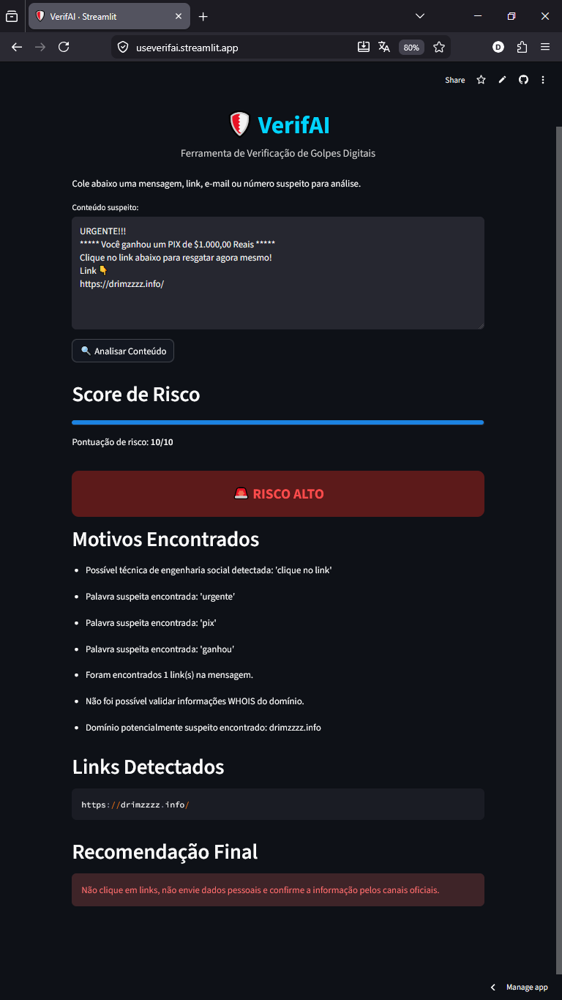

# 🛡️ VerifAI

Ferramenta de análise heurística e preventiva para identificação de possíveis golpes digitais, phishing, links suspeitos e tentativas de engenharia social.

Desenvolvida no projeto extensionista “Segurança e Cidadania Digital: Educação e Tecnologia”, do curso de Tecnologia em Gestão da TI da PUCPR.

## 🌐 Acesse o VerifAI Online

useverifai.streamlit.app

## 📸 Demonstração




## 🎯 Objetivo

O VerifAI tem como objetivo auxiliar na identificação preventiva de possíveis golpes digitais, mensagens suspeitas, links maliciosos, e-mails fraudulentos e tentativas de engenharia social.

O projeto também busca promover conscientização e educação em segurança digital, alinhado principalmente ao **ODS 16 — Paz, Justiça e Instituições Eficazes**.

## 🚀 Funcionalidades atuais

- Interface web com Streamlit
- Análise heurística textual
- Detecção de palavras suspeitas
- Detecção de padrões de engenharia social
- Detecção de links
- Detecção de e-mails
- Detecção de telefones
- Validação estrutural de URLs
- Detecção de encurtadores suspeitos
- Identificação de domínios potencialmente suspeitos
- Análise WHOIS de domínio
- Detecção de URLs excessivamente longas
- Classificação de risco (baixo, médio ou alto)
- Score visual de risco
- Recomendações preventivas ao usuário
- Arquitetura modular

## 🧠 Como funciona

O VerifAI utiliza uma análise heurística baseada em:

- Palavras suspeitas;
- Engenharia social;
- Validação de URLs;
- Reputação básica de domínio;
- Análise WHOIS;
- Detecção de encurtadores;
- URLs excessivamente longas;
- Ausência de HTTPS;
- Identificação de e-mails e telefones.

A ferramenta não substitui soluções profissionais de segurança, mas atua como apoio educativo e preventivo.

## 🛠️ Tecnologias utilizadas

- Python 3.11
- Streamlit
- Regex
- Unicodedata
- Validators
- Python-WHOIS
- TLDExtract
- Git
- GitHub
- PyCharm Communityy

## 📁 Estrutura do projeto

```text
VerifAI/
├── assets/
├── config/
│   ├── __init__.py
│   └── security_rules.py
├── core/
│   ├── __init__.py
│   ├── analisador.py
│   └── score.py
├── docs/
├── services/
│   ├── __init__.py
│   └── url_reputation.py
├── utils/
│   ├── __init__.py
│   ├── normalizacao.py
│   └── regex_patterns.py
├── app.py
├── main.py
├── requirements.txt
├── README.md
└── .gitignore
```

## ▶️ Como executar

Clone o repositório:

```bash
git clone https://github.com/seu-usuario/verifai.git
```

Acesse a pasta:

```bash
cd verifai
```

Crie o ambiente virtual:

```bash
python -m venv .venv
```

Ative o ambiente virtual:

```bash
.venv\Scripts\activate
```

Instale as dependências:

```bash
pip install -r requirements.txt
```

Execute o projeto:

```bash
streamlit run app.py
```

## ☁️ Deploy:
O VerifAI está publicado online via Streamlit Community Cloud.

## 📌 Roadmap do Projeto

- [x] MVP com Streamlit
- [x] Detecção de links
- [x] Detecção de e-mails
- [x] Detecção de telefones
- [x] Score visual de risco
- [x] Organização modular do projeto
- [x] Validação real de URLs
- [x] Detecção de encurtadores
- [x] Integração com WHOIS
- [ ] Integração com VirusTotal
- [ ] Integração futura com WhatsApp Cloud API
- [ ] Painel educativo com dicas de segurança digital

## 🌍 Impacto social

O projeto busca contribuir para a cidadania digital, auxiliando pessoas a reconhecerem possíveis golpes e reduzindo riscos de fraudes digitais em comunidades, ONGs, escolas e igrejas.

## 👨‍💻 Autor

David Do Rosario Maciel  
Tecnologia em Gestão da Tecnologia da Informação — PUCPR
